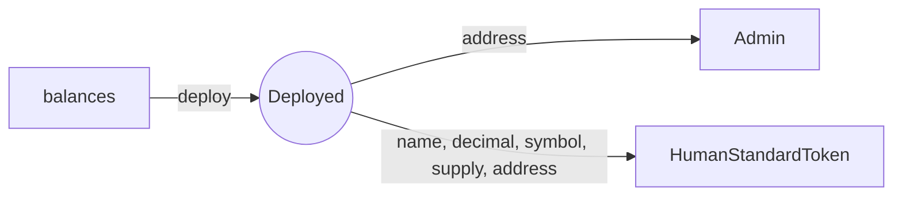
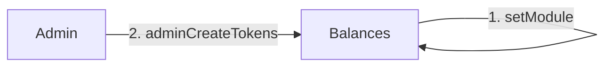

<span style="color:red">Airdrop can be tested using the *ERC20* contract. For testing run the test in *ERC20*</span>.

# Smart Contacts
Contains the implementations of the smart contracts for the tokenlab project, The implementation includes popular tokens like:  

1. [ERC20](https://github.com/ethereum/EIPs/blob/master/EIPS/eip-20.md)
2. [ERC223](https://github.com/ethereum/EIPs/issues/223)
3. [ERC644](https://github.com/ethereum/EIPs/issues/644)
4. [ERC777](https://github.com/ethereum/eips/issues/777)

The implementation is based on the procedures defined by [Openzeppelin](https://github.com/OpenZeppelin), [ConsenSys](https://github.com/ConsenSys)

## Getting Started
These instructions will get you a copy of the project up and running on your local machine for development and testing purposes. See deployment for notes on how to deploy the project on a live system.  

### Prerequisites
#### Ganache-cli
`ganache-cli` is written in Javascript and distributed as a Node package via `npm`. Make sure you have `Node.js (>= v6.11.5)` installed.
```
npm install -g ganache-cli
```
For more information visit [ganache-cli](https://github.com/trufflesuite/ganache-cli)

#### Truffle Suite
Truffle is a development environment, testing framework and asset pipeline for Ethereum, aiming to make life as an Ethereum developer easier.
```
 npm install -g truffle
 ```

 From there, you can run `truffle compile`, `truffle migrate` and `truffle test` to compile your contracts, deploy those contracts to the network, and run their associated unit tests.

#### Text Editor / IDE
You can use any Text Editor or IDE for the development of the `smart contracts`. Some of the poplars are:
* [Sublime](https://www.sublimetext.com/)
* [Atom](https://atom.io/)
* [Visual Studio Code](https://code.visualstudio.com/)
* [Remix IDE](http://remix.ethereum.org)

#### Development
Download the smart contracts into your local machine by using  
 
``
git clone http://172.25.33.144/hamza/SmartContracts
``

Change directory to the contract you want to modify.

``cd ERC<contract number>
``

##### Directory Structure
```
SmartContracts
	|-ERC<contract number>
		|-build
			|-contracts (compiled contracts)
		|-contracts		(non compiled contracts)
			|-Admin.sol
			|-Balances.sol
			|-Token.sol
			|-SafeMath.sol
			|-StandardToken.sol
			|-Migrations.sol
			|-HumanStandardToken.sol
		|-migrations	(migration files for deployment)
			|-1_initial_migration.js
			|-2_deploy_contracts.js
		|-test			(test files for the contracts)
		|-truffle-config.js
		|-truffle.js	(config files for the deployment network)
```

##### Compiling
For Compiling contracts 

``
truffle compile
``

##### Migration 
For Migrating contracts

``
truffle migrate
``

##### Interacting 
For interacting with the deployed contract use 

``
truffle console
``

visit [console](https://truffleframework.com/docs/getting_started/console) for more information.

or 

Use [web3](https://github.com/ethereum/web3.js/)  for interacting the deployed contracts.

##### Working
There is a certain procedure in which `contracts` are deployed and one have to insure this procedure for proper working of the deployed `token`. 


`Balances` should be deployed first and using the `address` of the `balances contract` `Admin` and `HumanStandardToken` should be deployed.


To increase supply `mint tokens` only `Admin` can do that and `Admin` contract should be added to the `Balances` contract using `setModule(address, true)` 



#### Testing 
For testing `smart contracts` use 

``
truffle test
``

For testing single `contract` or `test file` use

``
truffle test /< directory name >/ < filename > 
``

